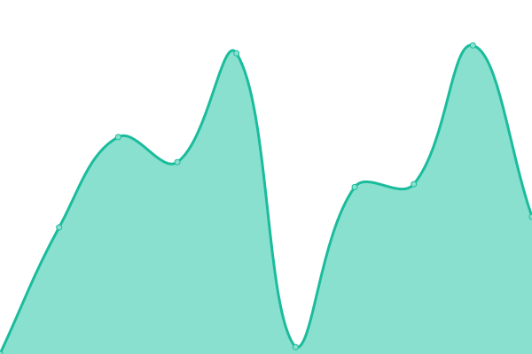
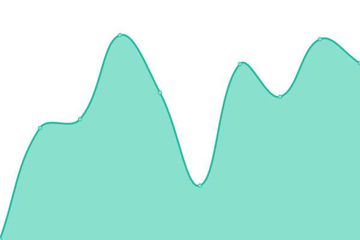

# [📈 Live Status](https://GiDHome.github.io/status-licence-manager): <!--live status--> **🟧 Partial outage**

This repository contains the open-source uptime monitor and status page for [GiD](www.gidhome.com), powered by [Upptime](https://github.com/upptime/upptime).

With [Upptime](https://upptime.js.org), you can get your own unlimited and free uptime monitor and status page, powered entirely by a GitHub repository. We use [Issues](https://github.com/GiDHome/status-licence-manager/issues) as incident reports, [Actions](https://github.com/GiDHome/status-licence-manager/actions) as uptime monitors, and [Pages](https://GiDHome.github.io/status-licence-manager) for the status page.

<!--start: status pages-->
<!-- This summary is generated by Upptime (https://github.com/upptime/upptime) -->
<!-- Do not edit this manually, your changes will be overwritten -->
<!-- prettier-ignore -->
| URL | Status | History | Response Time | Uptime |
| --- | ------ | ------- | ------------- | ------ |
|  [Licence Manager](https://licence.gidsimulation.com/) | 🟩 Up | [licence-manager.yml](https://github.com/GiDHome/status-licence-manager/commits/HEAD/history/licence-manager.yml) | 

 828ms
     
 | 

<a href="https://GiDHome.github.io/status-licence-manager/history/licence-manager">100.00%</a>
    

|  [Licence Manager - Login API](https://licence.gidsimulation.com/v1/Auth/Login?fingerprint=gidsimulation&machine_name=status) | 🟩 Up | [licence-manager-login-api.yml](https://github.com/GiDHome/status-licence-manager/commits/HEAD/history/licence-manager-login-api.yml) | 

 640ms
     
 | 

<a href="https://GiDHome.github.io/status-licence-manager/history/licence-manager-login-api">100.00%</a>
    

|  [Licence Manager - View list licences](https://licence.gidsimulation.com/View/UserLicence) | 🟩 Up | [licence-manager-view-list-licences.yml](https://github.com/GiDHome/status-licence-manager/commits/HEAD/history/licence-manager-view-list-licences.yml) | 

 704ms
     
 | 

<a href="https://GiDHome.github.io/status-licence-manager/history/licence-manager-view-list-licences">100.00%</a>
    

|  [Licence Manager - list licences API](https://licence.gidsimulation.com/v1/UserLicence/List) | 🟥 Down | [licence-manager-list-licences-api.yml](https://github.com/GiDHome/status-licence-manager/commits/HEAD/history/licence-manager-list-licences-api.yml) | 

 143ms
     
 | 

<a href="https://GiDHome.github.io/status-licence-manager/history/licence-manager-list-licences-api">0.00%</a>
    

<!--end: status pages-->

[**Visit our status website →**](https://GiDHome.github.io/status-licence-manager)

## 📄 License

- Powered by: [Upptime](https://github.com/upptime/upptime)
- Code: [MIT](./LICENSE) © [GiD](www.gidhome.com)
- Data in the `./history` directory: [Open Database License](https://opendatacommons.org/licenses/odbl/1-0/)
